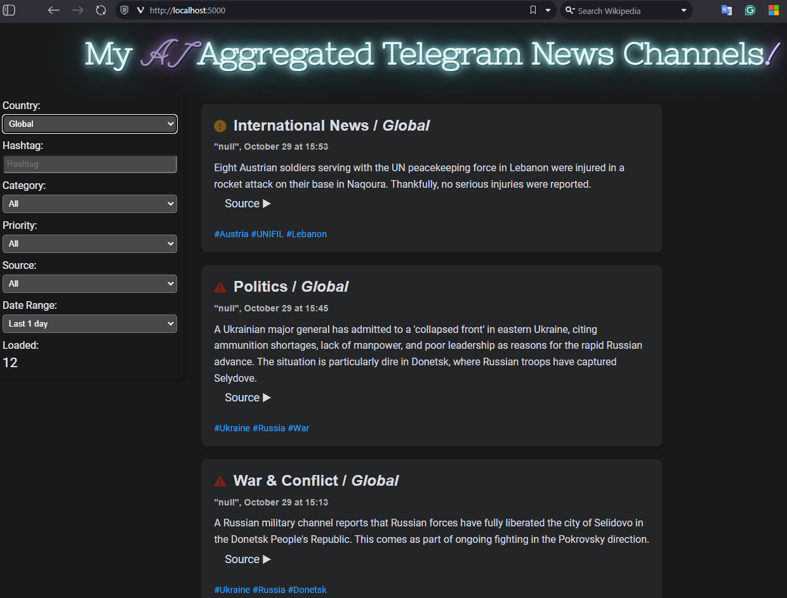
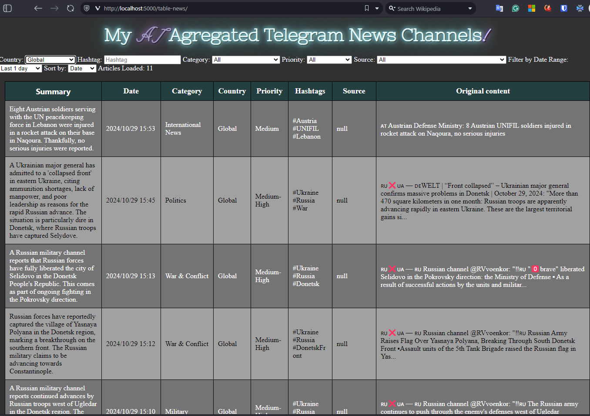

# telegram-ai-analytics

This is a Python application that aggregates news from Telegram public news channels, analyzes them using a local language model (LM) [Gemma2](https://ollama.com/library/gemma2) via [Open WebUI](https://github.com/open-webui/open-webui) + [Ollama](https://github.com/ollama/ollama), and outputs the result through a web API to a local web page with various filtering methods.

## Demo video

[](https://youtu.be/foXqt_iNpU8)

## Features

📢 **Aggregation:** Subscribe to multiple public Telegram news groups and aggregate their messages in real-time.

🧠 **Analysis:** Analyze news messages using Gemma2, powered by Open WebUI + Ollama. Extract key insights, summarize articles, and more!

⚙️ **Web Interface:** A user-friendly web page with filtering methods to customize your news feed:
  - Filter by country, hashtag, category, priority, source, and date range.
  - Sort news by date.

## Setup

To set up the application, follow these steps:
1. Clone this repository:

   ```bash
   git clone https://github.com/aqualx/telegram-ai-analytics.git
   ```
2. Install dependencies:

   ```bash
   pip install -r requirements.txt
3. Set up your Telegram ***app_id*** and ***api_hash*** following the [Creating your Telegram Application Setup](https://core.telegram.org/api/obtaining_api_id) instructions.
4. Configure environment variables at ***.env*** file:
   - `API_ID`: Telegram app_id from the step above.
   - `API_HASH`: Telegram api_hash from the step above.
   - `USER_NAME`: Your Telegram user name.
   - `OPEN_WEBUI_TOKEN`: Your user API key for *Open WebUI*
   - `OPEN_WEBUI_HOST`  = https://YOUR_OPEN_WEBUI_HOSTNAME/ollama
   - `CHATS_NAMES`: A list of public Telegram group IDs or usernames. For example:
   ```
   CHAT_NAMES = ["INSIDER | News | Politics | USA", "Sports Hub | Football"]
   ```
5. Run `python telegram_ai_analytics.py ` to start the application.
6. Open a web browser and navigate to `http://localhost:8080` to access the web page.

## How it works

The application uses the Telegram Bot API to retrieve news messages from public Telegram channels. It then analyzes these messages using the local LM Gemma2 via "Open WebUI + Ollama" and outputs the result through a web API to a local web page with various filtering methods.

### Web Page

The web page displays the latest news articles aggregated from public Telegram channels. Users can filter the results by country, hashtag, category, priority, source, date range, and sort order. The web page also allows users to view detailed information about each news article, such as the author, publication date, and a summary of the content.




### Web API

The application exposes a RESTful Web API that provides access to the aggregated news data.

## Contributing

Contributions are welcome! Please submit an issue or create a pull request with your proposed changes.

## License

This project is licensed under the MIT License - see the [LICENSE](https://github.com/[USERNAME]/telegram-news-aggregator/blob/main/LICENSE) file for details.
